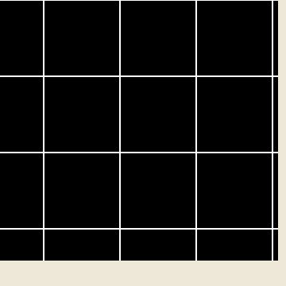

# 3D Geometric Game


**Live demo:** https://mohamedalaa3.github.io/3DGeometricGame/

A small **3D game written from scratch in C#** on **.NET Framework 4.8 / WinForms**, using a hand-rolled software 3D renderer drawn with GDI+ (`System.Drawing`) — no OpenGL, DirectX, or external graphics libraries.

You control a cube that climbs a grid of wireframe cubes while avoiding the red "holes". The whole 3D pipeline (camera, perspective projection, transforms) is implemented by hand and rasterized as 2D lines onto a double-buffered bitmap.

## Demo



*The player cube (blue wireframe) ascends the grid past the red holes; the second half shows the viewpoint panning under keyboard control. Recorded running under Mono on Linux.*

## Features

- Custom software 3D renderer: camera basis construction, world→camera transform, and perspective projection all implemented in code.
- Wireframe rendering of arbitrary models (points + edges) via GDI+ line drawing.
- 3D transforms: scale, translate, rotation about the X/Y/Z axes, and rotation about an arbitrary axis.
- Interactive camera (pan/dolly) and per-frame animation driven by a WinForms `Timer`.
- Double-buffered drawing to an off-screen `Bitmap` to avoid flicker.

## Controls

| Key | Action |
| --- | --- |
| `W` | Advance the player cube up the grid |
| `A` / `D` | Move the player cube left / right |
| `X` / `Y` / `Z` | Rotate the reference cube about the X / Y / Z axis |
| `←` / `→` | Pan the camera along X |
| `↑` / `↓` | Move the camera along Z (dolly in / out) |
| `F` / `G` | Move the camera along Y (up / down) |
| `P` `Q` `E` `R` `T` | Rotate models about arbitrary axes |

## Project structure

| File | Responsibility |
| --- | --- |
| `In_Lec/Program.cs` | Application entry point |
| `In_Lec/Form1.cs` | Game loop, input handling, level/map setup, scene drawing |
| `In_Lec/Camera.cs` | Camera model: view-basis construction and perspective projection |
| `In_Lec/Matrix.cs` | Vector math (normalize, cross product) |
| `In_Lec/Transformation.cs` | Scale / translate / rotate transforms applied to models |
| `In_Lec/_3D_Model.cs` | A model as a list of 3D points + edges; projects and draws itself |
| `In_Lec/_3D_Point.cs` | 3D point type |
| `In_Lec/Edge.cs` | An edge (index pair + color) |
| `In_Lec/Transform.cs` | Transform helpers |

## How the renderer works

1. **Camera basis** — `Camera.BuildNewSystem()` computes an orthonormal view basis from the center-of-projection (`cop`), the look-at point, and the up vector using normalized cross products.
2. **World → camera** — `TransformToOrigin_And_Rotate()` translates each world point relative to the camera and expresses it in the camera basis.
3. **Projection** — `TransformToOrigin_And_Rotate_And_Project()` applies a perspective divide (`focal * x / z`) and maps the result to screen pixels.
4. **Rasterization** — each `_3D_Model` projects the two endpoints of every edge and draws a line with GDI+ (`Graphics.DrawLine`). The full scene is composited onto an off-screen `Bitmap` and blitted to the form.

## Building and running

The project targets **.NET Framework 4.8** and builds to an x86 `WinExe`.

### Windows (Visual Studio)

Open `In_Lec.sln` in Visual Studio and build/run (F5). The original solution was authored in Visual Studio 2010 and upgraded to target .NET Framework 4.8.

### Linux / macOS (Mono)

.NET Framework WinForms runs on [Mono](https://www.mono-project.com/) with `libgdiplus`. On Debian/Ubuntu:

```bash
# Toolchain + GDI+ + an X server for the GUI
sudo apt-get update
sudo apt-get install -y mono-complete libgdiplus xvfb x11-utils imagemagick

# Build
xbuild /p:Configuration=Debug In_Lec.sln

# Run (needs an X display; use an existing one or start a headless Xvfb)
Xvfb :99 -screen 0 1280x1024x24 &
DISPLAY=:99 mono In_Lec/bin/Debug/In_Lec.exe
```

### Cloud Agents

A ready-to-use Cursor Cloud Agent environment is committed at [`.cursor/environment.json`](.cursor/environment.json). It installs Mono + `libgdiplus` and builds the solution on setup; the GUI can then be run on the environment's desktop display (`DISPLAY=:1`).

## Known issues

- **Nondeterministic startup crash.** The starting cube is chosen with a per-cell `new Random()` in `Form1_Load`; on some launches no cube is assigned (`mycube` stays `-1`) and the first timer tick throws `ArgumentOutOfRangeException` in `rot2`/`moveUP` (`map[mycube]`). Relaunching yields a healthy run.
- **Window size under Mono.** WinForms applies the form's `Maximized` state after `Form1_Load` reads `ClientSize`, so under Mono the scene is rendered at the smaller design-time size in the top-left of the window. This is cosmetic and does not occur on Windows.
